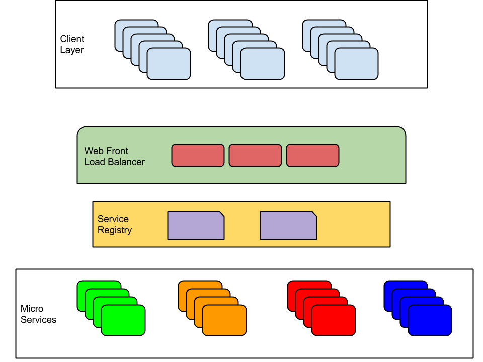

#Microservices using Async Libraries and MongoDB

##Outline
###Agenda
- Architecture definition
- Dataset extrapolation
- Services layout
- Team Setup

###Abiding Laws
- One verb per single function micro-service
- One developer produces one micro-service
- Each micro-service has it's own build
- Statefull data access layer
- Synchronization process is it's own micro-service
- We store data into MongoDB
- We expose services using Flask
- Everything else is your choice

###Fundamentals
- Versioning
  - we can have several different versions of the same service running
  - we don't need to shutdown previous
- Deployment
  - We will be deploying in containers
  - Docker for the rescue
- Separate Data Store for each service
  - we need to manage the synchronization of the master data
  - this will be a separate service!
- Treat Severs as Stateless
  - don't worry about a particular server
  - just make sure you have enough to keep the service running and scalable

### Architecture review
Microservices architecture generally follows the following schematics:

Your Client Layer will push requests, orchestrated by a load balancer (like ELB) and then get served that request by a webserver.
This webserver will know which micro-service to call for the different required services by checking the Service Registry (something like Zookeeper or Netflix Eureka).

And then you might have several different services that respond to a specific _"one verb"_ kind of function of your overall application

### What we are *NOT* going to be doing today!
For this exercise we are not going to put the complex _Service Registry_ or _Load Balancer_ in motion because (well, I'm a bit lazy) of time restrictions and because the overall exercise is around optimization of processes and Async sugar.

### What we are going to be doing
We will start with a small monolithic application that does 3 things:
- Lists the list of football players
- List available the competitions and teams
- Shows scores of results of those teams

#### References
http://microservices.io/patterns/service-registry.html
http://jasonwilder.com/blog/2014/07/15/docker-service-discovery/
http://martinfowler.com/articles/microservices.html
http://techblog.netflix.com/
https://github.com/Netflix/eureka
http://www.objectmentor.com/resources/articles/srp.pdf
http://plainoldobjects.com/presentations/building-and-deploying-microservices-with-event-sourcing-cqrs-and-docker/qconsf-2014-building-and-deploying-microservices-with-event-sourcing-cqrs-and-docker/
http://cppmicroservices.org/doc_latest/index.html
http://highscalability.com/blog/2014/4/8/microservices-not-a-free-lunch.html
http://techblog.netflix.com/2013/06/announcing-zuul-edge-service-in-cloud.html
http://blog.miguelgrinberg.com/

//end
